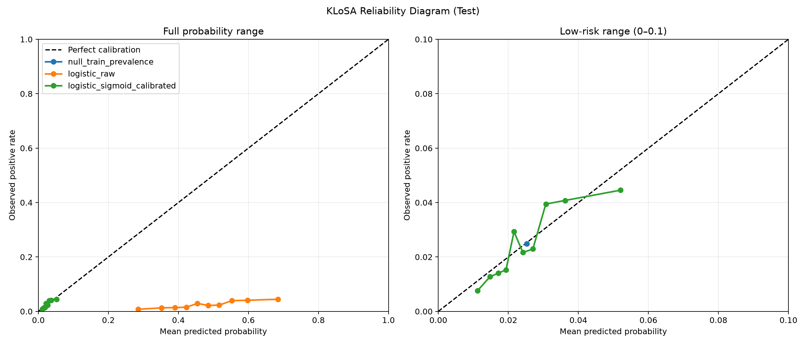

# KLoSA 전체 표본 재학습·확률 보정 보고서

## 1. 목적

축소 표본에서 선택된 Logistic Regression을 KLoSA 전체 적격 표본으로 재학습하고, 학습 양성률을 사용하는 Null Model과 Brier Score를 비교했다. Raw 확률과 sigmoid 보정 확률의 Calibration Curve·Reliability Diagram도 함께 평가했다.

## 2. 설계

| 항목 | 적용 내용 |
| --- | --- |
| 타깃 | t0 미진단자의 다음 인접 조사(약 2년) 신규 당뇨 진단 |
| Train | 36,273건, 양성 917건(2.528%) |
| Validation | 7,678건, 양성 187건(2.436%) |
| Test | 7,856건, 양성 195건(2.482%) |
| 분할 검증 | Train·Validation·Test 참가자 중복 0명 |
| 모델 선택 | Train 5-fold PID 그룹 교차검증, `C={0.01, 0.1, 1, 10}` |
| 선택된 C | `0.01` |
| 확률 보정 | Train OOF 예측에 sigmoid calibrator 적합 |
| 임계값 | Validation 확률 분위수 기반 적응형 탐색 후 고정 |
| Test 정책 | 모델·보정·임계값 고정 후 1회 평가 |

## 3. Null Model 정의

Null Model은 모든 사람에게 **Train 양성률 0.0252805**를 동일하게 예측한다. Test 양성률을 사용하지 않으므로 평가 데이터 누수가 없다.

- Brier Score: 예측확률과 실제 이진 결과 사이 평균제곱오차이며 낮을수록 좋다.
- Brier Skill Score: `1 - (모델 Brier / Null Model Brier)`
- `BSS > 0`: Null Model보다 개선
- `BSS = 0`: Null Model과 동일
- `BSS < 0`: Null Model보다 나쁨

## 4. 전체 Test 결과

| 모델 | AUROC | AUPRC | Recall | Specificity | Brier | BSS | ECE |
| --- | ---: | ---: | ---: | ---: | ---: | ---: | ---: |
| Null Model | 0.500 | 0.0248 | 0.000 | 1.000 | 0.024206 | 0.0000 | 0.0005 |
| Logistic Raw | 0.641 | 0.0413 | 0.692 | 0.495 | 0.236634 | -8.7759 | 0.4493 |
| Logistic Sigmoid Calibrated | 0.641 | 0.0413 | 0.692 | 0.495 | 0.024079 | +0.0053 | 0.0048 |

Sigmoid 보정은 순위와 동일한 임계값 분류를 유지해 AUROC·AUPRC·Recall·Specificity는 바꾸지 않았지만, Brier와 ECE를 크게 개선했다. 다만 BSS가 `+0.0053`에 불과해 Null Model 대비 확률 예측 개선 폭은 매우 작다.

Validation에서 선택된 보정 임계값은 `0.0226168`이며 Recall 0.743, Specificity 0.506이었다. 동일 임계값의 Test Specificity는 0.495로 최소 기준 0.50을 통과하지 못했다.

## 5. 연령군별 Test 결과

| 연령군 | N/양성 | AUROC | AUPRC | Recall | Specificity | Brier | BSS |
| --- | ---: | ---: | ---: | ---: | ---: | ---: | ---: |
| 45~64세 | 3,954/78 | 0.664 | 0.0485 | 0.500 | 0.695 | 0.019207 | +0.0083 |
| 65세 이상 | 3,902/117 | 0.600 | 0.0431 | 0.821 | 0.290 | 0.029015 | +0.0032 |

65세 이상은 Recall은 높지만 71.4%를 양성으로 분류했고 Specificity가 0.290이었다. 주 타깃이 고령층이라는 이유만으로 현재 임계값을 서비스에 적용하면 거짓 경고가 과도하게 발생한다.

## 6. Reliability Diagram

- Raw class-weight 확률은 0.3~0.7 수준을 주로 출력하지만 실제 양성률은 약 1~5%여서 확률로 해석할 수 없다.
- Sigmoid 보정 후 예측 범위가 실제 유병률 근처로 이동했고 Null Model보다 소폭 낮은 Brier를 기록했다.
- 일부 고위험 bin은 대각선에서 벗어나므로 외부·시간 검증 없이 개인별 발병확률로 표시하면 안 된다.

## 7. 결정

- 서비스 후보는 `logistic_sigmoid_calibrated`로 기록하되 상태는 `candidate_internal_not_for_personal_probability_display`로 유지한다.
- Raw class-weight 확률은 개인 확률로 저장·표시하지 않는다.
- 현재 Test Specificity가 기준 미달이고 BSS 개선이 작으므로 배포 승격하지 않는다.
- 다음 실험에서는 validation Specificity 안전 여유를 0.55~0.60으로 설정하고, 부트스트랩 신뢰구간과 시간·외부 검증을 추가한다.
