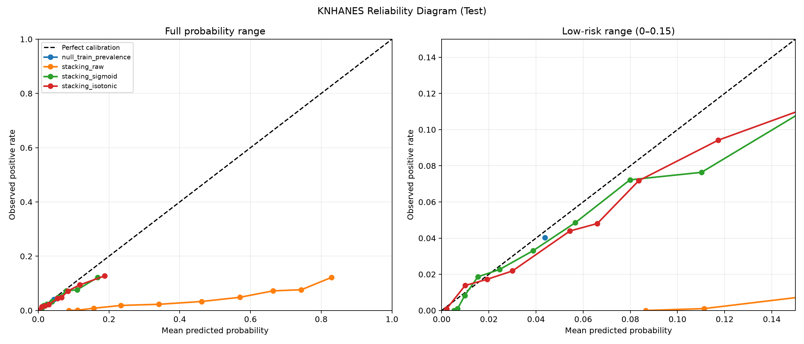

# KNHANES 전체 표본 모델·앙상블·후처리 비교 보고서

## 1. 결론

- KNHANES 전체 표본을 시간 분할로 재학습했다. 타깃은 미래 발병이 아니라 **현재 미진단 성인의 당뇨 위험 신호 선별**이다.
- 전역 validation 선택 후보는 `전체 Stacking + Sigmoid + 임계값 조정`이었다. Test Recall은 0.890이지만 Specificity가 0.496으로 최소 기준 0.50을 통과하지 못했다.
- 모델별 사전 선택 후보 중 Test 기준을 통과한 것은 `Random Forest + Sigmoid`와 `Soft Voting + Sigmoid`였다.
- Stacking의 Isotonic 후처리는 Test Recall 0.874, Specificity 0.512, BSS +0.0289로 균형이 좋았지만, Test 확인 후 소급해 최종 후보로 바꾸지 않는다.
- 모든 후보는 `candidate_internal_not_for_personal_probability_display`로 유지한다.

## 2. 전체 표본과 실행 범위

| Split | 조사연도 | N | 양성 | 양성률 |
| --- | --- | ---: | ---: | ---: |
| Train | 2016~2020 | 26,005 | 1,140 | 4.384% |
| Validation | 2021~2022 | 9,132 | 415 | 4.544% |
| Test | 2023~2024 | 9,691 | 390 | 4.024% |

- 기본 모델 4종: Logistic Regression, Random Forest, XGBoost, LightGBM
- 각 기본 모델 후보 3개씩, 총 12개 설정 × 5-fold = 60회 기본 교차검증 적합
- 앙상블 6종: Soft Voting, OOF Blending, 전체 Stacking, 트리 전용 3종
- Stacking meta model도 5-fold 교차적합하여 자기 학습 예측을 보는 누수를 방지
- 모델 구조 10종 × 후처리 4종 = 40개 비교 후보 + Null Model
- 선택 순서: Validation 최소 제약 통과 → Recall → AUPRC → Specificity → BSS

## 3. 베이스라인 모델 비교

각 모델에서 후처리 방식은 Validation만으로 선택한 뒤 고정하여 Test에 적용했다.

| 모델 | Validation 선택 후처리 | Test AUROC | AUPRC | Recall | Specificity | BSS | Test 제약 |
| --- | --- | ---: | ---: | ---: | ---: | ---: | --- |
| Logistic Regression | Sigmoid+임계값 | 0.765 | 0.113 | 0.874 | 0.500 | +0.0249 | 미달(0.4995) |
| Random Forest | Sigmoid+임계값 | 0.755 | 0.103 | 0.874 | 0.504 | +0.0283 | 통과 |
| XGBoost | Sigmoid+임계값 | 0.761 | 0.103 | 0.890 | 0.497 | +0.0283 | 미달 |
| LightGBM | Raw+임계값 | 0.749 | 0.096 | 0.864 | 0.499 | -3.8338 | 미달 |

Random Forest가 베이스라인 중 유일하게 Test 최소 Specificity를 통과했다. XGBoost는 Recall이 가장 높았지만 거짓 양성 부담이 더 컸다.

## 4. 앙상블 비교

| 모델 | Validation 선택 후처리 | Test AUROC | AUPRC | Recall | Specificity | BSS | Test 제약 |
| --- | --- | ---: | ---: | ---: | ---: | ---: | --- |
| Soft Voting | Sigmoid+임계값 | 0.764 | 0.107 | 0.879 | 0.502 | +0.0282 | 통과 |
| OOF Blending | Raw+임계값 | 0.766 | 0.109 | 0.887 | 0.499 | -4.1376 | 미달 |
| 전체 Stacking | Sigmoid+임계값 | 0.768 | 0.112 | 0.890 | 0.496 | +0.0298 | 미달 |
| 트리 Soft Voting | Sigmoid+임계값 | 0.759 | 0.103 | 0.885 | 0.499 | +0.0276 | 미달 |
| 트리 OOF Blending | Sigmoid+임계값 | 0.760 | 0.103 | 0.879 | 0.499 | +0.0279 | 미달 |
| 트리 Stacking | Sigmoid+임계값 | 0.763 | 0.105 | 0.887 | 0.497 | +0.0287 | 미달 |

전체 Stacking이 AUROC·Recall·BSS는 가장 높았지만 Test Specificity 기준을 통과하지 못했다. Soft Voting은 성능이 약간 낮아지는 대신 최소 제약을 통과했다.

## 5. Stacking 후처리 비교

| 후처리 | Recall | Specificity | Brier | BSS | ECE | Test 제약 |
| --- | ---: | ---: | ---: | ---: | ---: | --- |
| Raw, 임계값 0.5 | 0.800 | 0.598 | 0.231633 | -4.9951 | 0.3796 | 통과 |
| Raw, Validation 임계값 | 0.890 | 0.496 | 0.231633 | -4.9951 | 0.3796 | 미달 |
| Sigmoid+임계값 | 0.890 | 0.496 | 0.037484 | +0.0298 | 0.0119 | 미달 |
| Isotonic+임계값 | 0.874 | 0.512 | 0.037520 | +0.0289 | 0.0116 | 통과 |

- 임계값 조정은 Recall을 높였지만 Raw 확률의 보정 오류는 고치지 못한다.
- Sigmoid는 순위를 유지하면서 Brier·BSS·ECE를 크게 개선했다.
- Isotonic은 Recall을 약간 낮추고 Specificity를 높여 Test 최소 기준을 통과했다.
- Raw 확률은 개인 확률로 표시하면 안 된다.

## 6. 연령군별 전역 Validation 선택 후보 결과

| 연령군 | N/양성 | AUROC | AUPRC | Recall | Specificity | BSS |
| --- | ---: | ---: | ---: | ---: | ---: | ---: |
| 19~44세 | 3,358/45 | 0.871 | 0.071 | 0.778 | 0.809 | +0.0804 |
| 45~64세 | 3,702/169 | 0.722 | 0.115 | 0.870 | 0.406 | +0.0222 |
| 65세 이상 | 2,631/176 | 0.660 | 0.125 | 0.938 | 0.202 | +0.0228 |

65세 이상에서 Recall은 높지만 Specificity가 0.202로 매우 낮았다. 같은 전역 임계값을 모든 연령에 적용하면 고령층의 거짓 경고가 과도하게 발생한다.

## 7. Reliability Diagram

Raw Stacking 확률은 실제 양성률보다 크게 높아 개인 확률로 해석할 수 없다. Sigmoid와 Isotonic 보정은 저위험 구간의 확률 일치도를 크게 개선했지만, 시간·외부 검증 전에는 현재 위험 신호 점수로만 취급한다.

## 8. 결정과 다음 작업

1. 전역 validation 선택 후보는 Stacking+Sigmoid로 기록하되 Test 제약 미달로 배포하지 않는다.
2. Random Forest+Sigmoid와 Soft Voting+Sigmoid를 재현 가능한 안정성 후보로 유지한다.
3. Stacking+Isotonic은 후속 사전등록 실험 후보로 두고 현재 Test를 근거로 소급 선택하지 않는다.
4. 다음 실험부터 Validation Specificity 안전 여유, 연도별 부트스트랩 신뢰구간, 65세 이상 별도 임계값의 임상적 타당성을 사전에 확정한다.
5. KNHANES 결과는 미래 발병확률이 아니라 현재 위험 신호 선별로만 표현한다.
